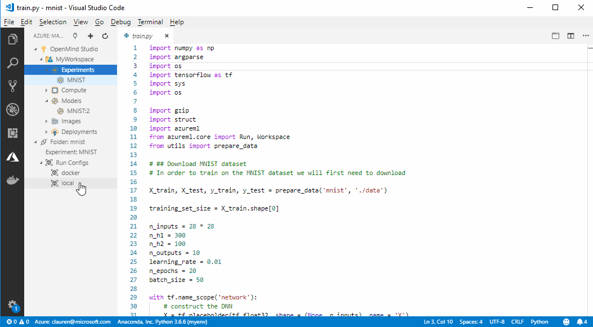

## DEPRECATED DOC- This extension has been re-designed to focus on providing a great experience working with the Azure Machine Learning service. Please check out the latest doc in the [parent folder](..).
# Train and tune models in Visual Studio Code
Azure Machine Learning provides support for running experiments locally and on remote compute targets. For every experiment you can keep track of multiple runs as often you will need to iteratively try different techniques, hyperparameters, and more. You can use Azure Machine Learning to track custom metrics and experiment runs, enabling data science reproducibility and auditability.

## Running experiments with Azure Machine Learning

Using Azure Machine Learning in VS Code enables you to rapidly iterate on your code, step through and debug, and use your source code control solution of choice. For a walkthrough of editing, running, and debugging code locally, see the [Python Hello World Tutorial](https://code.visualstudio.com/docs/languages/python/docs/python/python-tutorial)

To run your experiment with Azure Machine Learning

1. Prepare Visual Studio Code to train and deploy your models using the [Getting started with Azure Machine Learning in Visual Studio Code](getting-started-aml-vscode.md)
2. Open the Azure Machine Learning view in the Azure activity bar
3. Expand your Azure subscription and Azure Machine Learning workspace
4. Right click the **Run Config** of either local or remote compute you want to use. To learn more about Run Configs see [Create and manage compute targets in Visual Studio Code](manage-compute-aml-vscode.md)
5. Select **Run Experiment**
6. Click **View Experiment Run** to see the integrated Azure Machine Learning portal to monitor your runs and see your trained models

## Congratulations!
You have successfully prepared Visual Studio Code for use with Azure Machine Learning. 

- To learn more about how to get started with Azure Machine Learning in Visual Studio Code, see [Getting started with Azure Machine Learning](/docs/getting-started-aml-vscode.md)
- To learn how to create and use Azure Virtual Machines, Azure Batch AI clusters and Azure Kubernetes clusters from Visual Studio Code to train and deploy your models, see [Create and manage compute targets in Visual Studio Code](manage-compute-aml-vscode.md)
- To learn how to deploy and manage models from Visual Studio Code , see [Deploying and managing models in Visual Studio Code](deploy-models-aml-vscode.md)
